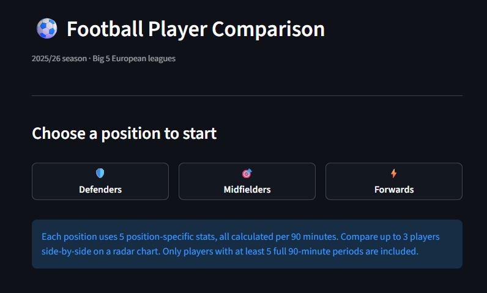

# ⚽ Football Player Statistic Checker

An interactive web dashboard for comparing football players from the 2025/26 season across Europe's Big 5 leagues. Select a position, search for players by name, and compare up to 3 of them side-by-side on a radar chart — all stats calculated per 90 minutes.

---

## 🚀 Live Demo

https://football-player-statistics-24xappdmpytnzk3sttey8ep.streamlit.app

---

## 📸 Screenshots

**Position picker — home screen**


**Player search dropdown**
[Screenshot: the search box with a player name half-typed and the matching dropdown results visible]

**Radar chart — 3 players compared**
[Screenshot: a fully populated radar chart with 3 players, showing the black/red/green lines overlapping, the percentile table above, and the three player chips with remove buttons]

---

## ✨ Features

- **Position** — choose Defenders, Midfielders, or Forwards before searching, so only relevant players appear
- **Live search dropdown** — start typing a name and matching players appear instantly
- **Up to 3 players** compared simultaneously, each with a distinct colour (black / red / green)
- **All stats per 90 minutes** so players with different amounts of playing time are compared fairly
- **Percentile rankings** calculated within the position group — 100 = best, 0 = worst
- **No-fill radar chart** so overlapping shapes stay readable
- **Home button** resets the entire session and starts over

---

## 📊 Stats by Position

| Position | Stats |
|---|---|
| 🛡️ **Defenders** | Tackles Won, Interceptions, Fouls Committed, Clean Sheet %, Yellow Cards |
| 🎯 **Midfielders** | Interceptions, Tackles Won, Assists, Goals, Shots on Target |
| ⚡ **Forwards** | Goals, Assists, Shots on Target, Crosses, Fouls Drawn |

Fouls and yellow cards are **inverted** (lower = higher percentile) so the radar always rewards the better player visually.

---

## 🛠️ Built With

- **Python 3.10+**
- **[Streamlit](https://streamlit.io)** — web UI and session state
- **[Plotly](https://plotly.com/python/)** — interactive radar chart
- **[Pandas](https://pandas.pydata.org/)** — data loading, filtering, per-90 calculations

---

## ⚙️ Setup & Installation

```bash
# 1. Clone the repo
git clone https://github.com/YOUR_USERNAME/football-player-statistics.git
cd football-player-statistics

# 2. (Recommended) Create a virtual environment
python -m venv venv
source venv/bin/activate        # Windows: venv\Scripts\activate

# 3. Install dependencies
pip install -r requirements.txt

# 4. Run the app
python -m streamlit run app.py
```

The app will open automatically at `http://localhost:8501`.

---

## 📁 Project Structure

```
football-player-statistics/
├── app.py                  # Streamlit entry point — UI flow & session state
├── requirements.txt        # Python dependencies
├── README.md
├── .gitignore
├── data/
│   └── players_data_light-2025_2026.csv   # 2025/26 Big 5 leagues player stats
└── src/
    ├── __init__.py
    ├── config.py           # Position stat definitions, colours, thresholds
    ├── data_loader.py      # CSV loading, cleaning, position filtering
    ├── stats.py            # Per-90 calculations & percentile ranking logic
    └── radar_chart.py      # Plotly radar/spider chart builder
```

---

## 📐 How It Works

1. **Data loading** — the CSV is loaded once and cached with `@st.cache_data` so the app stays fast.
2. **Position filtering** — players are categorised by their primary position (the first position listed, e.g. `MF,FW` → MF). Only players with at least 5 full 90-minute periods are shown to avoid noisy stats from tiny sample sizes.
3. **Per-90 calculation** — raw counting stats (goals, tackles, etc.) are divided by the `90s` column. Rate stats like Clean Sheet % are left as-is.
4. **Percentile ranking** — each player's value is ranked against everyone else in the same position group. For negative stats (fouls, cards) the ranking is inverted so a higher percentile always means a better player.
5. **Radar chart** — built with Plotly's `Scatterpolar` in lines-only mode (no fill) so 3 overlapping shapes stay legible.

---

## ⚠️ Known Limitations

- **Clean Sheet %** is recorded per-goalkeeper in FBref, not per-defender, so most defenders will show low values on that axis. A future fix would be to scrape FBref's defensive table for per-player block and clearance stats.
- **No xG / xA** — expected goals and assists are not in this dataset. 

---

## 🔮 Potential Extensions

- Scrape FBref's Passing and Possession tables to add progressive passes, key passes, take-ons, and progressive carries
- Add xG / xA from FBref's Expected table
- Build a **"similar players" finder** using cosine similarity on the per-90 stat vector
- Add **season-over-season** trend comparison
- Deploy on **Streamlit Community Cloud** for a shareable public link

---

## 📂 Data Source

Player statistics sourced from [FBref.com](https://fbref.com) — 2025/26 season covering the Premier League, La Liga, Serie A, Bundesliga, and Ligue 1.
